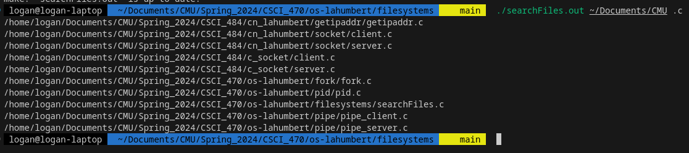

# Simple application that searches files from a given directory that have a given extension.

## How to compile
```bash
make
```

## How to run
```bash
./searchFiles.out <directory> <extension>
```

## screenshot

