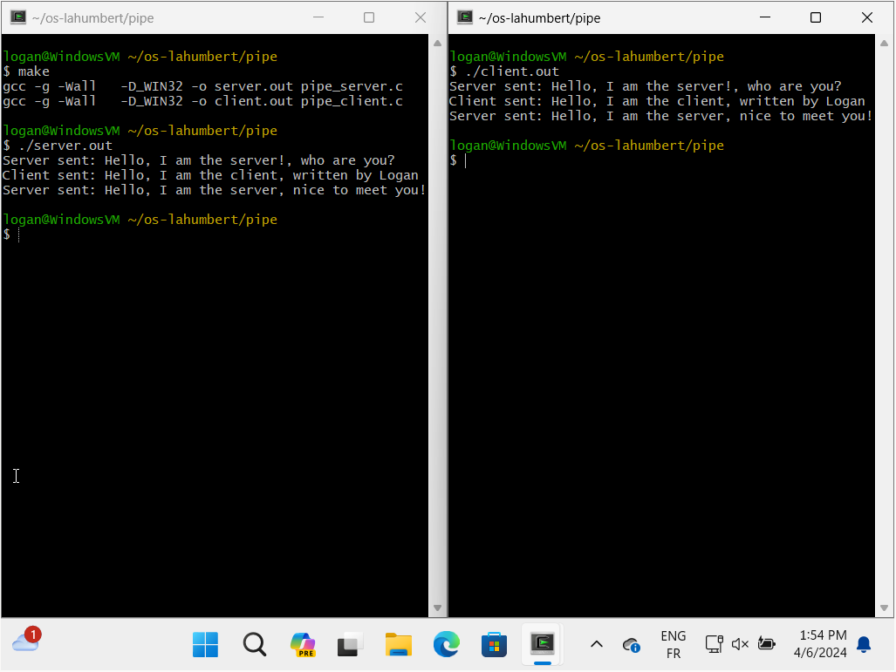
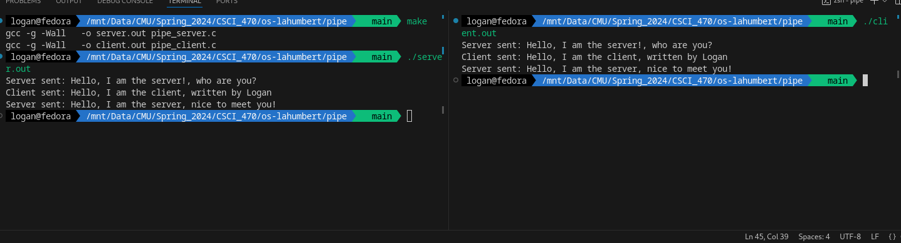

# Communication between processes via a pipe

This example demonstrates how to communicate between two processes using a named pipe.
It has been designed to work on both Windows and Unix systems.

## How to run

1. Compile the `pipe_server.c` and `pipe_client.c` files using the following command:
    ```bash
    make
    ```
2. Run the server using the following command:
    ```bash
    ./pipe_server
    ```
3. Run the client using the following command:
    ```bash
    ./pipe_client
    ```

## Screenshots
Execution of the server and client on Windows and Linux systems respectively.



