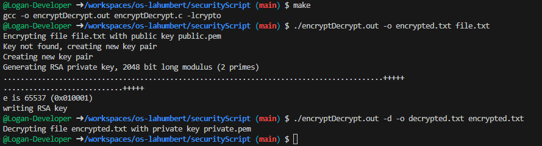
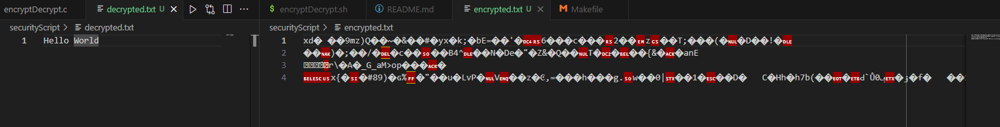
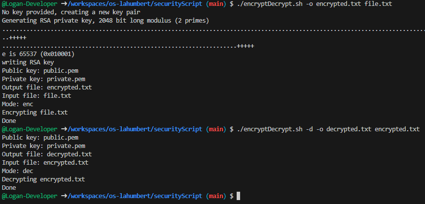
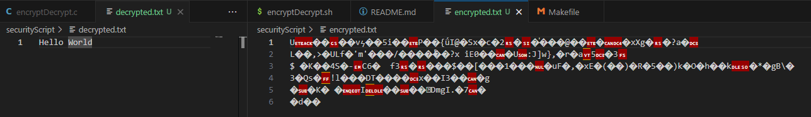

# Bash script and C program to encrypt / decrypt data using public / private key encryption

## Usage

```bash
./encyptDecrypt.sh [-e|-d] [-k <keyfile>] [-o <outputfile>] <inputfile>
```

or for the C program

```bash
./encryptDecrypt.out [-e|-d] [-k <keyfile>] [-o <outputfile>] <inputfile>
```

## Options

- `-e` : Encrypt the input file
- `-d` : Decrypt the input file
- `-k <keyfile>` : Use the keyfile for encryption / decryption
- `-o <outputfile>` : Write the output to the outputfile

## Compile the C program

```bash
make
```

## Screenshots C program





## Screenshots Bash script




