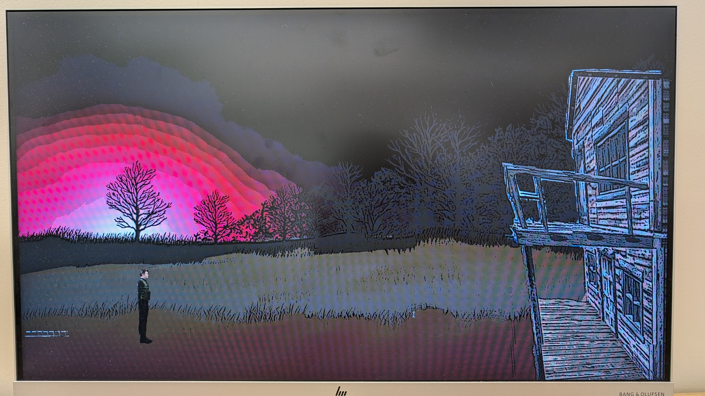

# A video game with threads and mutexes

Threads and mutexes are located in game_v2/src/game.hpp
```bash
cd game_v2/src/game.hpp
```
To run:
```bash
cd game_v2
make && make run
```
We added in mutexes to the sprites, physics, and collision threads.
This was done so that the threads could do things like refresh the sprites and the physics and to check for the collisions that are occuring.

Threads are defined line 248 to line 303 in game.hpp for draw thread, physics thread, and collision thread. Mutexes are locked and unlocked here as well as in the functions to add a sprite and animated sprite to the game.

Threads are created at line 321 and 322 in game.hpp.
We have just commented out the use of the draw thread as some OS (like Fedora Linux) require the rendering to be done on the main thread.

## Screenshot


